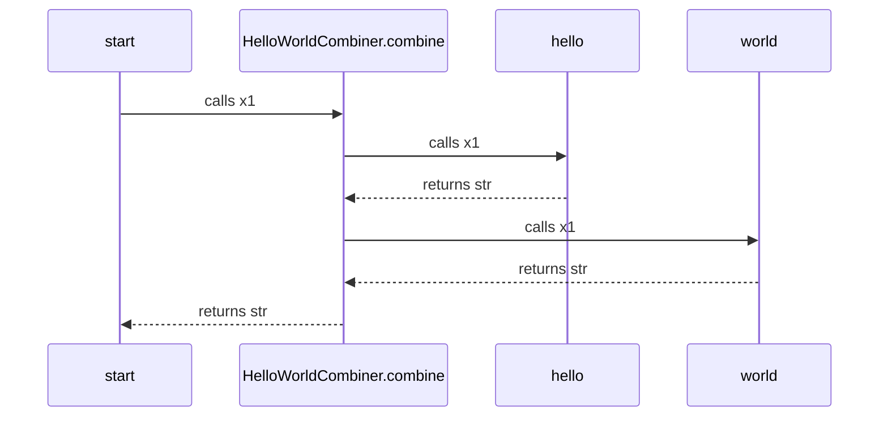

# playarea

## APPS

1. Karnevalsorden Editor
2. Spotify
3. Mahjongg

## Angular

1. `ng new playarea --skip-git=true --skip-tests=true`

## Django

### Django

1. `django-admin startproject playarea`
2. `python manage.py startapp main`

### Vue

1. `npm init`
2. package.json korregieren
3. `npm install axios leaflet vue vue-router vuetify vuex jquery --save`
4. `npm install webpack webpack-cli webpack-dev-server babel-loader @babel/core @babel/preset-env vue-loader vue-template-compiler babel-eslint -D`
5. Eventuell wichtige Module für *devDependencies*
   1. `css-loader`
   2. `eslint-loader`
   3. `sass-loader`
   4. `vue-loader`
   5. `vue-style-loader`
   6. `vuetify-loader`

## Webpack

* letztes Webpack 4: **"webpack": "^4.44.2"**,

## Sonstiges

### Django MVC

| Django   | MVC        |
| -------- | ---------- |
| Model    | Model      |
| Template | View       |
| View     | Controller |

### Mermaid (alternative zu PlantUML)

